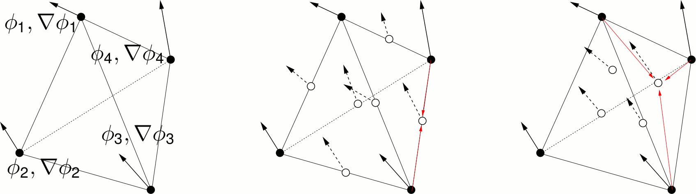

## Element formulation

- A C1-continuous tetrahedral element requires a complete 9th-order polynomial (binomial(2dimension+1 + dimension over 2dimension+1)), which has in 3D binomial(12 over 9)=220 monomials, see Ženı́šek, A. (1973). “Polynomial approximation on tetrahedrons in the finite element method”. In: Journal of Approximation Theory 7.4, pp. 334–351.
- Taking the field value &Phi; and its gradient &nabla;&Phi; as 4 degrees of freedom (DOF), this requires 55 nodes. This is too much. 
- Therefore, we consider an incompatible mode element, requiring C1-continuity only at specific nodes
- To be compatible with ordinary C3D4 meshes we interpolate pseudo-DOF (pDOF) at 10 points: the six corner centers and the 4 face centers

- It is important that only adjacent nodes are involved when interpolating the pDOF (red arrows). This ensures common pDOF-values at adjacent elements
- we have then 14*4=56 = binomial(8 over 5) 
