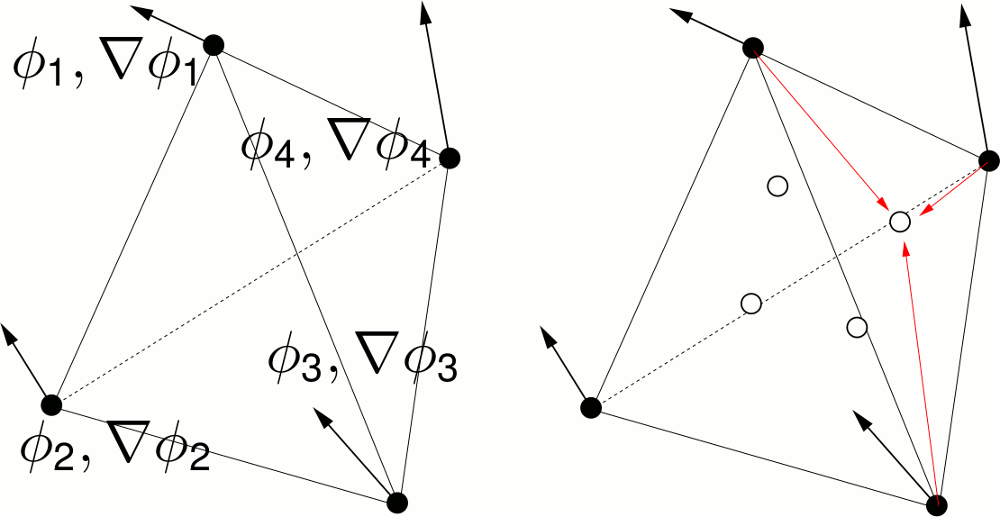

## Element formulation

- A C1-continuous tetrahedral element requires a complete 9th-order polynomial (binomial(2dimension+1 + dimension over 2dimension+1)), which has in 3D binomial(12 over 9)=220 monomials, see Ženı́šek, A. (1973). “Polynomial approximation on tetrahedrons in the finite element method”. In: Journal of Approximation Theory 7.4, pp. 334–351.
- Taking the field value &Phi; and its gradient &nabla;&Phi; as 4 degrees of freedom (DOF), this requires 220/4=55 nodes. This is too much. 
- Therefore, we consider an incompatible mode element, requiring C1-continuity only at specific nodes

# 3rd-order polynomial 
- a 3D 3rd-order polynomial has 20 monomials
- To be compatible with ordinary C3D4 meshes we interpolate 4 pseudo-DOF (pDOF) at 4 points: the function values at the  face centers

- It is important that only adjacent nodes are involved when interpolating the pDOF (red arrows). This ensures common pDOF-values at adjacent elements
- we have then 16 DOF + 4 pDOF = binomial(3+3 over 3), which means we can adopt a complete  3rd-order polynomial
- Numerical integration is done with rules from Jinyun, Y. (1984). “Symmetric gaussian quadrature formulae for tetrahedronal regions”. In: Computer Methods in Applied Mechanics and Engineering 43, pp. 349–353. and Cools, R. (2003). “An encyclopaedia of cubature formulas”. In: Journal of Complexity 19.3. Oberwolfach Special Issue, pp. 445–453. We use 29 integration points with positive weights, the integration is exact up to 6th order polynomials

# 5th-order polynomial 
- a 3D 5th-order polynomial has 56 monomials
- To be compatible with ordinary C3D4 meshes we interpolate 40 pseudo-DOF (pDOF) at 10 points: at the six corner centers and the 4 face centers we interpolate the function value (1) and its gradient (3)

- It is important that only adjacent nodes are involved when interpolating the pDOF (red arrows). This ensures common pDOF-values at adjacent elements
- we have then 10 DOF + 14*4 pDOF = binomial(5+3 over 5), which means we can adopt a complete  5th-order polynomial
- Note that the higher order element is more sensitive to extreme aspect ratios
- Numerical integration is done with rules from Jinyun, Y. (1984). “Symmetric gaussian quadrature formulae for tetrahedronal regions”. In: Computer Methods in Applied Mechanics and Engineering 43, pp. 349–353. and Cools, R. (2003). “An encyclopaedia of cubature formulas”. In: Journal of Complexity 19.3. Oberwolfach Special Issue, pp. 445–453. We use 29 integration points with positive weights, the integration is exact up to 6th order polynomials

Continue here: [Mathematica: Shape function derivation and code generation](../2_Mathematica)
